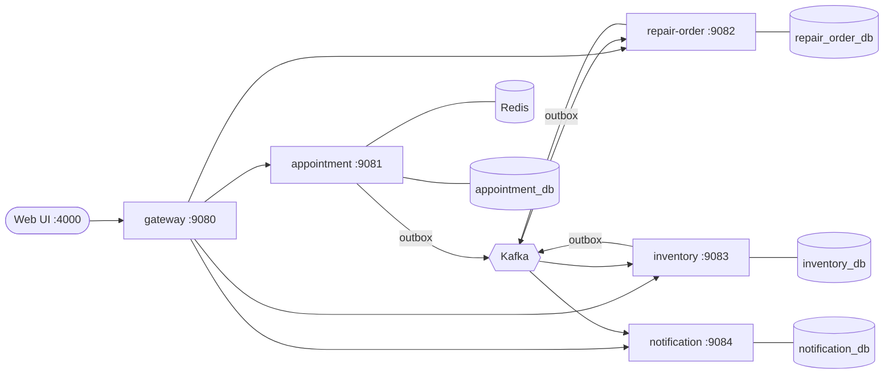

# Gearbay design

Gearbay is the Node.js implementation of the same system as [Torqline](https://github.com/chethansv23/torqline)
(Java / Spring Boot). The architecture, database schema, events and REST API are identical, so the same web UI,
demo script and load test run against either. This document covers the design and the Node-specific choices.

## Architecture



| Service | Owns | Consumes | Publishes |
|---|---|---|---|
| appointment | dealers, bays, appointments | none | AppointmentBooked, AppointmentCheckedIn, AppointmentCancelled |
| repair-order | job cards, part lines, invoices | AppointmentCheckedIn, PartsReserved, PartsReservationFailed | RepairOrderCreated, PartsReservationRequested, RepairOrderCompleted, RepairOrderCancelled |
| inventory | stock, reservations | PartsReservationRequested, RepairOrderCompleted, RepairOrderCancelled | PartsReserved, PartsReservationFailed, PartLowStock |
| notification | sent messages | everything | none |
| gateway | routing, request ids | none | none |

## Key mechanisms

**No double booking.** A Postgres exclusion constraint
`EXCLUDE USING gist (bay_id WITH =, tstzrange(slot_start, slot_end) WITH &&) WHERE status <> 'CANCELLED'`
makes overlapping bookings on one bay impossible. Each booking attempt runs in its own transaction that first takes
`pg_advisory_xact_lock(7001, bayId)`: without it, concurrent conflicting inserts deadlock while checking the
constraint (found under load in Torqline). The service tries bays that look free first and maps `23P01` to "try the
next bay". See `services/appointment/src/appointmentService.js`.

**Several services per booking.** A booking stores `service_types` (an array, 1-5 services). They run back to
back on one bay, so availability and the exclusion constraint use the summed duration; the repair order charges
labour per service (`labourLines`). The API accepts `serviceTypes` and still accepts a single `serviceType` from
older clients; availability takes `?serviceTypes=A,B`. Migration `003_multiple_services.sql` converts existing
single-service bookings.

**Transactional outbox.** `appendOutbox(client, …)` writes the event with the *same pg client* as the state change,
so both commit or neither does. `startOutboxRelay` polls with `FOR UPDATE SKIP LOCKED`, sends a batch with
`acks: -1`, then marks rows published. See `packages/common/src/outbox.js`.

**Idempotent consumers.** `processOnce(pool, eventId, handler)` inserts the event id into `processed_event` and runs
the handler in one transaction, so redelivered events are skipped. See `packages/common/src/idempotency.js`.

**Retries and dead letters.** `runConsumer` retries a failing message 3 times, 1 s apart, then publishes it to
`<topic>.dlt` with the error attached. See `packages/common/src/kafka.js`.

**Parts saga.** Repair order → `PartsReservationRequested` → inventory locks the parts `ORDER BY sku FOR UPDATE`
(fixed lock order, no deadlocks) and reserves everything or nothing → `PartsReserved` / `PartsReservationFailed`.
Completion consumes stock; cancellation releases it. Late replies for cancelled orders are ignored.

**Caching.** Each dealer-day's booked intervals are cached in Redis for 60 s. Redis errors fall back to Postgres;
the database always decides bookings.

## Node-specific choices

| Concern | Choice | Why |
|---|---|---|
| Runtime | Node 22, ES modules | Current LTS; native `Map.groupBy`, `import.meta.dirname` |
| HTTP | Express 5 | Most widely known; v5 forwards async errors to the error handler |
| Validation | zod 4 | Schemas double as documentation; errors map to `VALIDATION_FAILED` with per-field messages |
| Database | `pg` with raw SQL | The interesting logic lives in SQL (constraints, locks), so an ORM would hide it |
| Transactions | `withTransaction(pool, fn)` | Explicit client passing; the equivalent of Spring's `TransactionTemplate` |
| Migrations | Small built-in runner (`migrate`) | Applies numbered SQL files once, under an advisory lock |
| Kafka | kafkajs | Pure JavaScript and the most widely used Node client. Its last release was in 2023; `@confluentinc/kafka-javascript` is the maintained alternative with a compatible API |
| Money | Integer paise | JavaScript numbers are floats; `0.1 + 0.2 !== 0.3`. Postgres `numeric` strings are parsed exactly |
| Time zones | Luxon | Converts dealer-local slot times to UTC instants correctly |
| Logging | pino | Structured JSON logs |
| Tests | Vitest, supertest, Testcontainers | Unit tests, HTTP-contract tests and real-Postgres race tests |

## Code layout

```
packages/common/src
  constants/        topics, event types, headers, error codes, SQL states, domain catalogue
  db.js             pool, withTransaction, migrate
  http.js           createApp (request id, health, problem responses), ApiError, parse
  outbox.js         appendOutbox, startOutboxRelay
  idempotency.js    processOnce
  kafka.js          createKafka, ensureTopics, runConsumer (retries + DLT), decode
  domain.js         vehicle and service rules, labour pricing
  money.js          paise conversion
services/<name>
  src/constants/    service constants and error codes
  src/dto/          zod request schemas and response views
  src/*Service.js   business logic
  src/routes.js     HTTP routes
  src/index.js      wiring: migrate, Kafka, relay, consumers, HTTP server
  migrations/       numbered SQL files
  test/             *.test.js (unit) and *.it.test.js (Testcontainers)
web/                React + TypeScript UI (same as Torqline, rebranded)
```

## Java (Torqline) → Node (Gearbay)

| Torqline (Spring Boot) | Gearbay (Node.js) |
|---|---|
| `@RestController`, `@RequestMapping` | Express routes in `routes.js` |
| Bean Validation (`@Valid`, `@NotBlank`) | zod schemas in `dto/schemas.js` |
| `@RestControllerAdvice` | Error middleware in `createApp` |
| JPA entities + repositories | Raw SQL in services and `repository.js` |
| `@Transactional` / `TransactionTemplate` | `withTransaction(pool, client => …)` |
| Flyway | `migrate()` with numbered SQL files |
| `@KafkaListener` + `DefaultErrorHandler` | `runConsumer` with retries and DLT |
| `KafkaTemplate` | kafkajs producer |
| `@Scheduled` outbox relay | `setTimeout` loop in `startOutboxRelay` |
| Spring auto-configuration (`torqline-common`) | npm workspace package `@gearbay/common` |
| `BigDecimal` | Integer paise |
| `java.time` / `ZoneId` | Luxon |
| Spring Cloud Gateway | Express + http-proxy-middleware |
| JUnit 5, Mockito, MockMvc | Vitest, `vi.fn()`, supertest |
| Testcontainers (Java) | Testcontainers (Node) |
